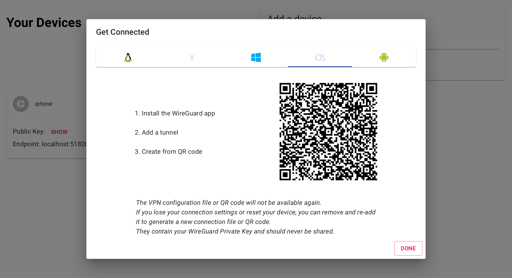
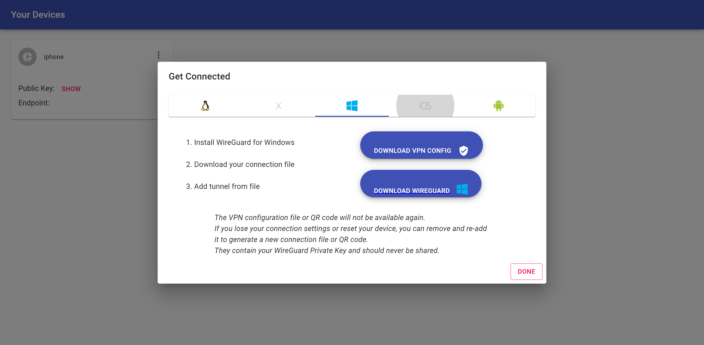

# WG Access Server

_i'm still thinking of a name..._

## What is this

This project aims to create a simple VPN solution for developers,
homelab enthusiasts and anyone else feeling adventurous.

This project offers a single docker container that provides a WireGuard
VPN server and device management web ui that's simple to use.

Today, this project allows you to deploy a WireGuard VPN using a single
docker container; use a web ui to add/connect your Linux/Mac/Windows/iOS/Android
device; and manage connected devices. The server will automatically
configure ip routes and iptables rules to ensure that client VPN traffic
can access the internet.

The docker container runs wireguard in userspace using [boringtun](https://github.com/cloudflare/boringtun)
and only required NET_ADMIN plus access to /dev/net/tun.
The privileges are required by boringtun to create a userspace tun/tap device
which is a userspace virtual network interface ([wikipedia](https://en.wikipedia.org/wiki/TUN/TAP))
and for the software to configure iptables and network routes within it's network
namespace. The container doesn't require host networking but it can be used so that
VPN client's can access IP addresses otherwise accessible from the host's network.

Soon I hope to add the following features

- [ ] headless mode
  * in this mode there'll be no web ui
  * you can add devices (i.e. WireGuard peers) via files, flags or the environment
  * intended for use by developers to easily deploy a one-shot style
    VPN into a network to get access to it on their local machine,
    i'm hoping to use this mode to VPN into a kubernetes cluster's
    overlay network including DNS and cluster service routing.
- [x] singleuser mode
  * this is how the project currently works but I'll expand it to support authentication
- [x] multiuser mode
  - [x] support pluggable authentication backends including OAuth, OpenID Connect, LDAP, etc.
  - [x] allow different users to manage thier own devices without seeing others
  - [ ] allow network isolation to be turned on or off allowing users to communicate or be isolated

## Running with Docker

```
docker run \
  -it \
  --rm \
  --name wg \
  --cap-add NET_ADMIN \
  --device /dev/net/tun:/dev/net/tun \
  -p 8000:8000/tcp \
  -p 51820:51820/udp \
  place1/wg-access-server
```

To use a custom [configuration](#configuration) file, please add a `CONFIG` environment variable and make sure the configuration file is mounted:
```
  ...
  -e CONFIG=/config/config.yaml
  -v ./config.yaml:/config/config.yaml
  ...
```

## Configuration

You can configure the server using a config file.

```bash
sudo go run ./main.go --config ./config.yaml
```

Here's an example showing the default values:

```yaml
loglevel: debug
web:
  // ExternalAddress is that users access the web ui
  // using. This value is required for using auth backends
  // This value should include the scheme.
  // The port should be included if non-standard.
  // e.g. http://192.168.0.2:8000
  // or https://myvpn.example.com
  externalAddress: ""
  // Port that the web server should listen on
  port: 8000
storage:
  // Directory that VPN devices (WireGuard peers)
  // should be saved under.
  // If this value is empty then an InMemory storage
  // backend will be used (not recommended).
  directory: ""
wireguard:
  // UserspaceImplementation is a command (program on $PATH)
  // that implements the WireGuard protocol in userspace.
  // In our Docker image we make use of `boringtun` so that
  // users aren't required to setup kernel modules.
  // You can leave this value empty if you want to run wireguard
  // in-kernal. The server will still connect to the "WireGuard.InterfaceName"
  userspaceImplementation: ""
  // The network interface name for wireguard
  interfaceName: wg0
  // The WireGuard PrivateKey
  // If this value is lost then any existing
  // clients (WireGuard peers) will no longer
  // be able to connect.
  // Clients will either have to manually update
  // their connection configuration or setup
  // their VPN again using the web ui (easier for most people)
  // If this value is empty then the server will use an in-memory
  // generated key
  privateKey: ""
  // ExternalAddress is the address that users
  // use to connect to the wireguard interface
  // This value is used in the generated client config
  // files. If this value is empty then the frontend
  // will use `${window.location.hostname}:51820`
  externalAddress: ""
  // The WireGuard ListenPort
  port: 51820
} `yaml:"wireguard"`
vpn:
  // CIDR configures a network address space
  // that client (WireGuard peers) will be allocated
  // an IP address from
  cidr: "10.44.0.0/24"
  // GatewayInterface will be used in iptable forwarding
  // rules that send VPN traffic from clients to this interface
  // Most use-cases will want this interface to have access
  // to the outside internet
  // If not configured then the server will select the default
  // network interface e.g. eth0
  gatewayInterface: ""
auth:
  // The below are all optional.
  // Different authentication backends can be configured.
  // If no authentication backends are configured then
  // the server will not require authentication.
  // The server embeds dex to provide the authentication
  // integrations - https://github.com/dexidp/dex
  oidc:
    name: ""
    issuer: ""
    clientID: ""
    clientSecret: ""
  gitlab:
    name: ""
    baseURL: ""
    clientID: ""
    clientSecret: ""
}
```

You can also set some configuration via environment variables:

```bash
export LOG_LEVEL="info"
export STORAGE_DIRECTORY="/my-data"
export WIREGUARD_PRIVATE_KEY="$(wg genkey)"
sudo go run ./main.go
```

## Screenshots





## Development

The software is made up a Golang server, React webapp and a WireGuard
implementation that must be provided by the system.

Here's how I develop locally:

1. run `./dev-wg.sh` to get wireguard running locally on `:51820`
2. run `cd website && npm install && npm start` to get the frontend running on `:3000`
3. run `sudo go run ./main.go` to get the server running on `:8000`

Here are some notes about the development configuration:

- sudo is required because the server uses iptables/ip to configure the VPN networking
- you'll access the website on `:3000` and it'll proxy API requests to `:8000` thanks to webpack dev proxy
- because we haven't configured a WIREGUARD_PRIVATE_KEY the server will generate one in-memory
- similarly we didn't configure a STORAGE_DIRECTORY so the server will store client config in-memory
